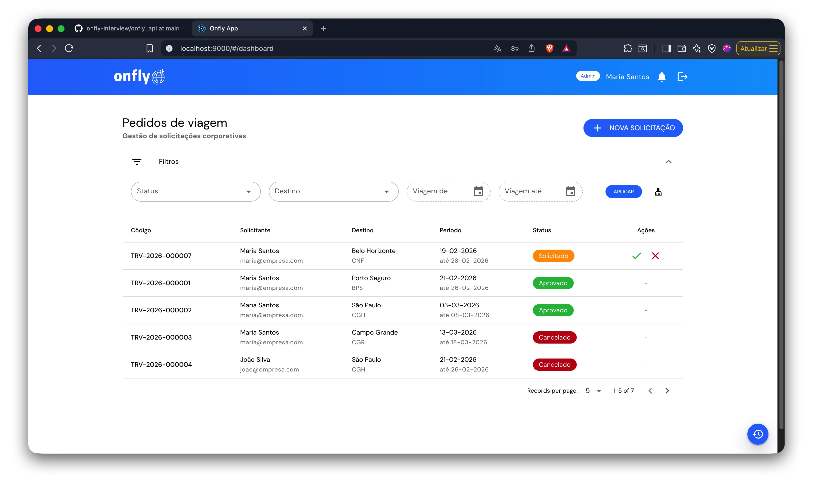
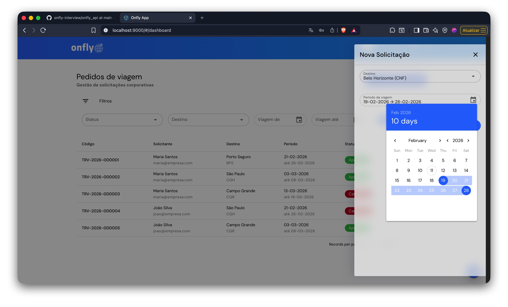
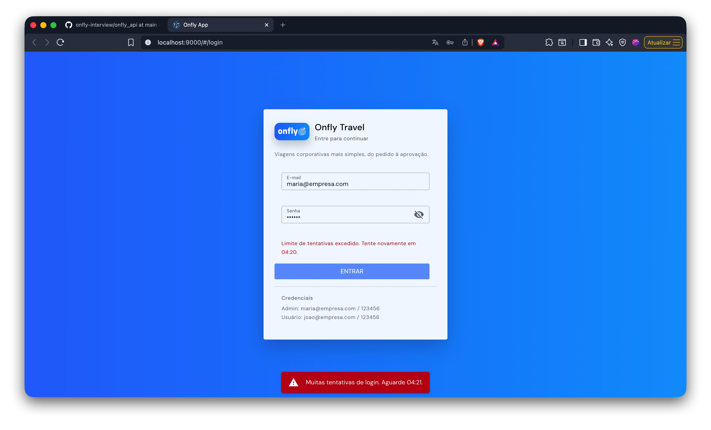
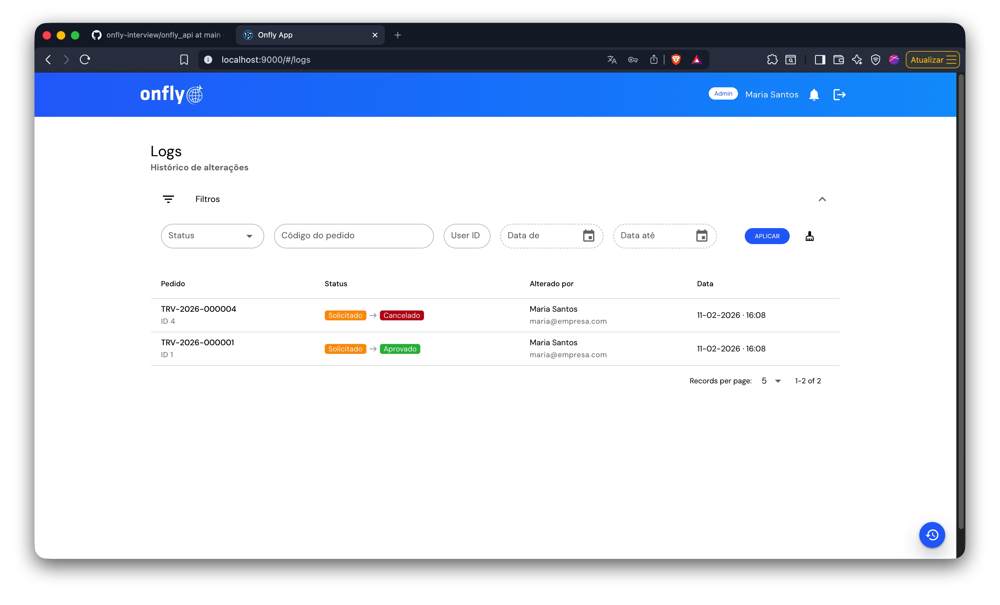

# Onfly Interview (Full Stack)

Aplicação full stack para **gestão de pedidos de viagem corporativa**.

## Tecnologias (versões)
- **PHP**: 8.4+
- **Laravel**: ^12
- **MySQL**: 8.4
- **Node**: 20+
- **Vue**: 3.5
- **Quasar**: 2.x (`@quasar/app-vite` 2.x)
- **Composer**: 2.8+

## Segurança (OWASP Top 10)
Esta solução foi construída com práticas alinhadas ao **OWASP Top 10**, com foco em:
- autenticação por token com expiração (Sanctum)
- controle de acesso por perfil e policies
- validação de entrada com Form Requests
- tratamento padronizado de erros para API
- CORS configurado por ambiente
- rate limit em autenticação (`login`)
- paginação server-side para evitar abuso de listagens
---

# Guia de Instalação (Docker + Local)

## 1) Clone do repositório
```bash
git clone https://github.com/DanielCostaGH/onfly-interview.git
cd onfly-interview
```

---

# Back-end (Laravel + Sail)

### 2) Entrar na pasta e instalar dependências
```bash
cd onfly_api
composer install
```

### 3) Preparar `.env`
```bash
cp .env.example .env
```

### 4) Subir containers
```bash
docker compose up -d --build
```

### 5) Gerar chave e preparar banco
```bash
./vendor/bin/sail artisan key:generate
./vendor/bin/sail artisan migrate --seed
```

### 6) Rodar testes do back-end
```bash
./vendor/bin/sail artisan test
```

**API disponível em:**  
`http://localhost`

---

# phpMyAdmin

Subiu junto com o Docker.

**Acesso:**
- `http://localhost:8081`

**Credenciais:**
- Usuário: `sail`
- Senha: `password`

---

# Front-end (Quasar)

### 7) Entrar na pasta do front
```bash
cd ../onfly_web
cp .env.example .env
```

## Opção A — Rodar local (Node 20+)
```bash
yarn install
yarn quasar dev
```
**Front disponível em:**  
`http://localhost:9000`

## Opção B — Rodar via Docker
```bash
docker run --rm -it -p 9000:9000 \
  -v "$(pwd):/app" -w /app node:20-bullseye \
  bash -lc "yarn install && yarn quasar dev --host 0.0.0.0 --port 9000"
```
**Front disponível em:**  
`http://localhost:9000`

---

# Credenciais Seed

- **Admin**: `maria@empresa.com` / `123456`
- **User**: `joao@empresa.com` / `123456`

---

# Postman / Insomnia

Arquivos na raiz do repositório:
- `Onfly.Postman.json`
- `Onfly_Insomnia.yaml`

---

# Galeria da Aplicação

| Dashboard | Nova Solicitação |
| --- | --- |
|  |  |

| Rate Limit no Login | Logs de Solicitações |
| --- | --- |
|  |  |
